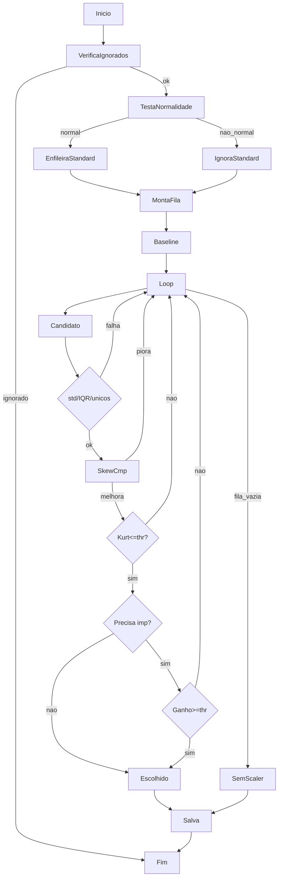
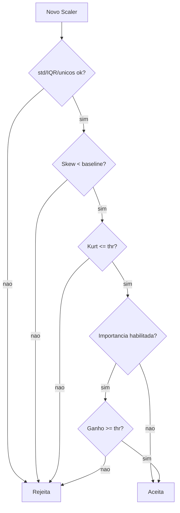

# 📊 DynamicScaler

**DynamicScaler** seleciona automaticamente o melhor scaler para cada variável numérica — e grava tudo de forma auditável.  
Ele combina testes estatísticos (normalidade, skew, curtose) com *optional* **validação cruzada preditiva** para garantir que **só transforma quando há ganho real**.

---
## ✨ Principais Características

| Característica               | Descrição |
|-----------------------------|-----------|
| **Estratégias**             | `'auto'`, `'standard'`, `'robust'`, `'minmax'`, `'quantile'`, `None` (passthrough). |
| **Teste de normalidade**    | `StandardScaler` só é considerado se o p‑valor do teste de Shapiro‑Wilk ≥ `shapiro_p_val`. |
| **Fila inteligente**        | Ordem preferencial: `PowerTransformer → QuantileTransformer → RobustScaler → MinMaxScaler` (*se* `allow_minmax=True`). |
| **Validação estatística**   | Avalia desvio padrão, IQR e número de valores únicos após transformação. |
| **Teste secundário**        | Compara a **kurtosis** com a linha de base e com o limiar `kurtosis_thr`. |
| **Validação de importância**| Aplicada se `extra_validation=True` *ou* para `MinMaxScaler`. Exige aumento ≥ `importance_gain_thr` usando `importance_metric`. |
| **Avaliação preditiva**     | O parâmetro `evaluation_mode` define se `LogisticRegression`, `Ridge` e `XGBoost` são usados na validação de importância. |
| **Auditável**               | O método `report_as_df()` exibe métricas, candidatos testados e motivos de escolha ou rejeição. |
| **Visualização**            | O método `plot_histograms()` compara distribuições antes e depois da transformação, indicando o scaler aplicado. |
| **Serialização segura**     | Salva apenas scalers aprovados, com hash das colunas para evitar erros de compatibilidade em produção. |

---
### Estratégia Auto
No modo `auto`, o DynamicScaler monta uma fila de candidatos baseada na normalidade dos dados. Cada scaler é testado em sequência e só é aceito se:
1. Desvio-padrão, IQR e nº de valores únicos pós-transformação superam `min_post_*`.
2. O skew diminui em relação ao baseline.
3. A curtose não piora e fica abaixo de `kurtosis_thr`.
4. Se exigido, o ganho de importância medido via `evaluation_mode` é ≥ `importance_gain_thr`.
Se todos falharem, a coluna segue sem transformação.

## 🚀 Exemplo Rápido

```python
import pandas as pd
from dynamic_scaler import DynamicScaler   # nome do módulo/arquivo

df = pd.read_csv("meus_dados.csv")

scaler = DynamicScaler(
    strategy="auto",
    serialize=True,
    save_path="scalers.pkl",
    extra_validation=False    # desliga CV para rapidez
)

scaler.fit(df)
df_scaled = scaler.transform(df, return_df=True)

print(scaler.report_as_df().head())
scaler.plot_histograms(df, df_scaled, features=['idade', 'renda_mensal'])
```

### Exemplo avançado com validação de importância

```python
scaler_cv = DynamicScaler(
    strategy="auto",
    extra_validation=True,    # habilita validação para todos
    allow_minmax=True,        # deixa MinMax entrar
    importance_gain_thr=0.10, # exige aumento de 10% de importância
    importance_metric="shap",
    evaluation_mode="both", # usa média de modelos lineares e não lineares
    random_state=42
)

scaler_cv.fit(df_train[num_cols], y_train)
X_test_scaled = scaler_cv.transform(df_test[num_cols], return_df=True)
print(scaler_cv.report_as_df().tail())
```

> ⚠ **Tip**
> Para modelos lineares (`evaluation_mode="linear"` ou `"both"`) o
> `DynamicScaler` usa `shap.LinearExplainer` automaticamente para obter
> importâncias consistentes. Se preferir, defina `importance_metric="gain"`
> ou `"coef"`.
> ℹ️ **partial_fit**: `StandardScaler`, `RobustScaler` e `MinMaxScaler` permitem atualização incremental. Para os demais, a chamada é ignorada.

---

## 📊 Fluxo de Decisão (`strategy='auto'`)



### Segunda etapa de Validação



---

## 📒 Referência de API

| Método | Descrição |
|--------|-----------|
| `fit(X, y=None)` | Treina e seleciona scalers; aceita `y` se precisar de CV. |
| `transform(X, return_df=False)` | Aplica scalers aprovados. |
| `inverse_transform(X)` | Reverte escalonamento. |
| `report_as_df()` | DataFrame detalhado com decisão e métricas. |
| `plot_histograms(orig, trans, features, show_qq=False)` | Visualiza distribuições antes/depois. |
| `save(path)` / `load(path)` | Serializa e restaura scalers + relatório + metadados. |

## 📝 Colunas do report

| Coluna | Descrição |
|--------|-----------|
| `chosen_scaler` | Nome do scaler aprovado ou `None`. |
| `validation_stats` | Métricas pós-transformação. |
| `ignored` | Lista de scalers ignorados. |
| `candidates_tried` | Candidatos testados. |
| `reason` | Pipe-separated flags explicando por que o scaler foi aceito (ex. stats|skew|kurt|imp). |

---

## ⚙️ Parâmetros Importantes

| Parâmetro | Default | Descrição |
|-----------|---------|-----------|
| `shapiro_p_val` | `0.01` | Valor‑p mínimo para considerar a variável normal. |
| `shapiro_n` | `5000` | Amostra máxima para o teste de Shapiro‑Wilk. |
| `validation_fraction` | `0.1` | Fração dos dados reservada para validação interna. |
| `kurtosis_thr` | `10.0` | Limite absoluto de curtose pós‑transformação. |
| `extra_validation` | `False` | Habilita CV preditiva para **todos** os candidatos. |
| `allow_minmax` | `True` | Permite que `MinMaxScaler` entre na fila. |
| `importance_metric` | `'shap'` | Métrica de importância: `'shap'`, `'gain'` ou função custom. |
| `importance_gain_thr` | `0.10` | Aumento relativo mínimo na importância da feature. |
| `evaluation_mode` | `nonlinear` | Escolhe modelos para validacao: `LogisticRegression`/`Ridge` para "linear", `XGBoost` para "nonlinear" ou ambos. |
| `cv_gain_thr` | `0.002` | (deprecated) mapeado para `importance_gain_thr`. |
| `ignore_scalers` | `[]` | Lista de scalers a serem ignorados de antemão. |
| `extra_scalers` | `[]` | Lista adicional de scalers (instâncias) testados após os padrões. |

*(veja `help(DynamicScaler)` para todos os parâmetros)*

---

## 🔐 Serialização e Hash

Ao salvar, o DynamicScaler:
1. Mantém **apenas os scalers aprovados** (`selected_cols_`).
2. Cria um **hash MD5** das colunas salvas para garantir consistência.  
   No `load()`, se o hash divergir, é levantado erro — evita usar um scaler
   incompatível com o dataset atual.

---

## 🤝 Contribuições

Contribuições são bem‑vindas!  
Faça **fork**, crie um branch, abra seu *pull request* e vamos evoluir juntos.  
Issues com dúvidas, bugs ou sugestões são muito bem‑vindas.

---

> **Licença**: MIT
