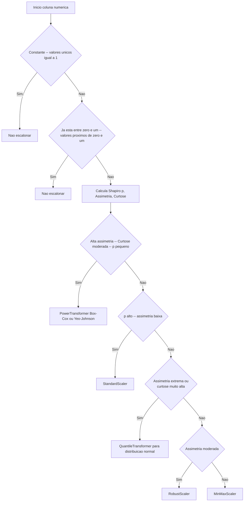

# 📊 DynamicScaler

Selecione e aplique dinamicamente o scaler mais adequado para cada feature numérica, com base em testes de normalidade (Shapiro), assimetria e detecção de outliers.

## ✨ Características

- **Estratégias disponíveis**:  
  - `auto`: decide o scaler por coluna usando critérios estatísticos.  
  - `standard`, `robust`, `minmax`, `quantile`: aplica o mesmo scaler a todas as colunas.  
  - `passthrough`: não aplica escalonamento.  
- **Compatível com `scikit-learn` Pipelines**, facilitando integração em fluxos de trabalho.  
- **Serialização** automática de scalers e relatórios em arquivo `.pkl` (`save` / `load`).  
- **Relatórios** via DataFrame (`report_as_df`) e **visualizações** de histogramas antes/depois (`plot_histograms`).

---

## 🚀 Exemplo Rápido

```python
import pandas as pd
from scaler import ScalerSelector

# Dados de exemplo
df = pd.DataFrame({
    'idade':   [25, 32, 47, 51, 62],
    'salario': [3000, 4200, 5500, 6100, 7200],
    'score':   [0.2, 0.5, 0.9, 0.7, 0.3]
})

# Inicializa o AutoScaler em modo automático
selector = DynamicScaler(strategy='auto', serialize=True, save_path='scalers.pkl')

# Ajusta os scalers ao DataFrame
selector.fit(df)

# Transforma os dados (retorna numpy array)
X_scaled = selector.transform(df)

# Ou, para obter DataFrame já escalonado:
df_scaled = selector.transform(df, return_df=True)

# Visualiza relatório de decisões
print(selector.report_as_df())

# Plota histogramas antes/depois
selector.plot_histograms(df, df_scaled, features=['idade', 'salario'])
```

## Exemplo com PowerTransformer

scaler = DynamicScaler(
    strategy="auto",
    power_skew_thr=1.2,
    power_kurt_thr=15,
    random_state=42,
    verbose=True
)
scaler.fit(df_train)
df_scaled = scaler.transform(df_full, return_df=True)

---

## 📒 API Reference

| Método                                                             | Descrição                                                                                          |
|--------------------------------------------------------------------|----------------------------------------------------------------------------------------------------|
| `fit(X, y=None)`                                                   | Ajusta cada scaler conforme a estratégia selecionada e preenche o relatório interno.               |
| `transform(X, return_df=False)`                                    | Aplica os scalers ajustados aos dados; retorna `DataFrame` se `return_df=True`, caso contrário `ndarray`. |
| `inverse_transform(X, return_df=False)`                            | Reverte o escalonamento aplicando o método inverso de cada scaler.                                 |
| `get_feature_names_out(input_features=None)`                       | Retorna nomes das features transformadas (compatível com pipelines).                               |
| `report_as_df()`                                                   | Retorna um `pd.DataFrame` com estatísticas e decisões de scaler por coluna.                        |
| `plot_histograms(original_df, transformed_df, features)`           | Plota histogramas lado a lado (antes/depois) para as features especificadas.                       |
| `save(path=None)`                                                  | Serializa scalers, relatório e metadados em um arquivo `.pkl`.                                     |
| `load(path)`                                                       | Carrega scalers, relatório e metadados previamente salvos.                                         |

---

## ⚙️ Configuração

| Parâmetro      | Tipo                                                              | Descrição                                                                 |
|----------------|-------------------------------------------------------------------|---------------------------------------------------------------------------|
| `strategy`     | `{'auto', 'standard', 'robust', 'minmax', 'quantile', None}`      | Estratégia de escalonamento (default: `'auto'`).                          |
| `shapiro_p_val`| `float`                                                           | Valor-p mínimo do teste de Shapiro para considerar normalidade (default: `0.01`). |
| `serialize`    | `bool`                                                            | Se `True`, salva automaticamente scalers e relatório em `save_path` após o `fit`. |
| `save_path`    | `str` \| `Path`                                                   | Caminho para o arquivo `.pkl` de serialização (default: `'scalers.pkl'`). |
| `random_state` | `int`                                                             | Semente para amostragem e `QuantileTransformer` (default: `0`).           |
| `logger`       | `logging.Logger` \| `None`                                        | Logger customizado; se `None`, cria logger padrão.                        |

---
## Fluxo da estratégia `auto`



## 🤝 Contribuições

Contribuições são bem-vindas! Para sugerir melhorias:

1. Faça um fork deste repositório.  
2. Crie um branch para sua feature:  
   ```bash
   git checkout -b feature/nome-da-feature
   ```  
3. Commit suas mudanças:  
   ```bash
   git commit -m "✨ Descrição da funcionalidade"
   ```  
4. Envie para o branch remoto:  
   ```bash
   git push origin feature/nome-da-feature
   ```  
5. Abra um Pull Request.
