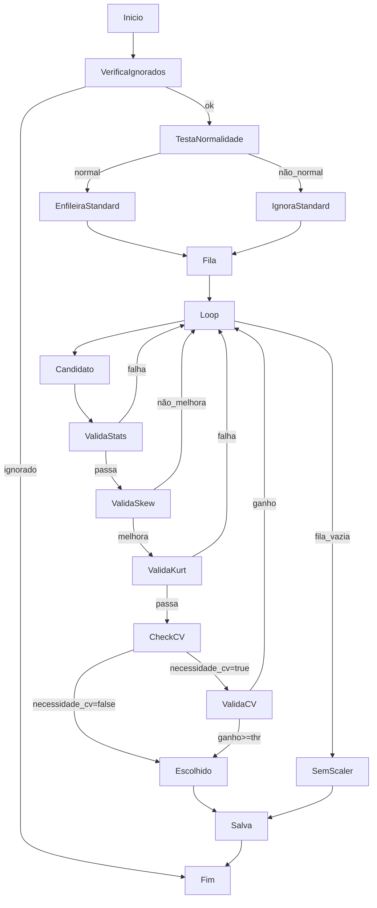
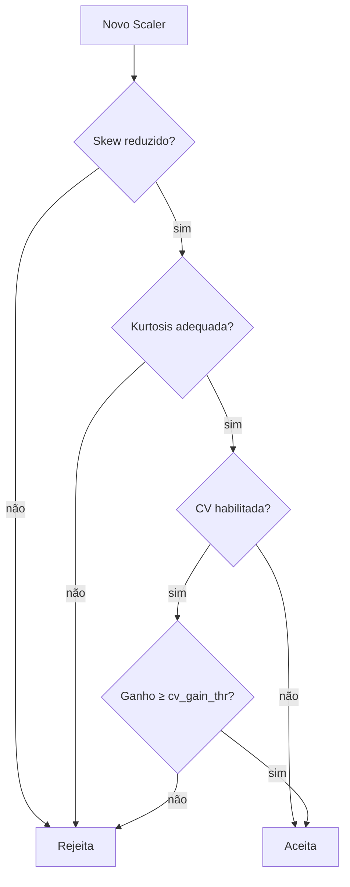

# 📊 DynamicScaler

**DynamicScaler** seleciona automaticamente o melhor scaler para cada variável numérica — e grava tudo de forma auditável.  
Ele combina testes estatísticos (normalidade, skew, curtose) com *optional* **validação cruzada preditiva** para garantir que **só transforma quando há ganho real**.

---

## ✨ Principais Características

| Recurso | Descrição |
|---------|-----------|
| **Estratégias** | `'auto'`, `'standard'`, `'robust'`, `'minmax'`, `'quantile'`, `None` (passthrough). |
| **Teste de normalidade** | `StandardScaler` só é considerado se o p‑valor do Shapiro‑Wilk ≥ `shapiro_p_val`. |
| **Fila inteligente** | `PowerTransformer → QuantileTransformer → RobustScaler → MinMaxScaler*` (*somente se `allow_minmax=True`). |
| **Validação estatística** | Checa pós‑transformação: desvio‑padrão, IQR e nº de valores únicos. |
| **Teste secundário** | Compara **kurtosis** à linha de base e a `kurtosis_thr`. |
| **Validação cruzada** | Se `extra_validation=True` *ou* para `MinMaxScaler`, roda CV com XGBoost e exige ganho ≥ `cv_gain_thr`. |
| **Auditável** | `report_as_df()` mostra métricas, candidatos testados, motivo de rejeição. |
| **Visual** | `plot_histograms()` compara distribuições antes/depois e exibe o scaler usado. |
| **Serialização segura** | Só salva scalers aprovados; usa hash de colunas para evitar mismatch em produção. |

---

## 🚀 Exemplo Rápido

```python
import pandas as pd
from dynamic_scaler import DynamicScaler   # nome do módulo/arquivo

df = pd.read_csv("meus_dados.csv")

scaler = DynamicScaler(
    strategy="auto",
    serialize=True,
    save_path="scalers.pkl",
    extra_validation=False    # desliga CV para rapidez
)

scaler.fit(df)
df_scaled = scaler.transform(df, return_df=True)

print(scaler.report_as_df().head())
scaler.plot_histograms(df, df_scaled, features=['idade', 'renda_mensal'])
```

### Exemplo avançado com validação cruzada

```python
scaler_cv = DynamicScaler(
    strategy="auto",
    extra_validation=True,    # habilita CV para todos
    allow_minmax=True,        # deixa MinMax entrar
    cv_gain_thr=0.003,        # exige ganho de 0.3 p.p. de AUC
    random_state=42
)

scaler_cv.fit(df_train[num_cols], y_train)
X_test_scaled = scaler_cv.transform(df_test[num_cols], return_df=True)
```

---

## 📊 Fluxo de Decisão (`strategy='auto'`)



### Segunda etapa de Validação



---

## 📒 Referência de API

| Método | Descrição |
|--------|-----------|
| `fit(X, y=None)` | Treina e seleciona scalers; aceita `y` se precisar de CV. |
| `transform(X, return_df=False)` | Aplica scalers aprovados. |
| `inverse_transform(X)` | Reverte escalonamento. |
| `report_as_df()` | DataFrame detalhado com decisão e métricas. |
| `plot_histograms(orig, trans, features, show_qq=False)` | Visualiza distribuições antes/depois. |
| `save(path)` / `load(path)` | Serializa e restaura scalers + relatório + metadados. |

---

## ⚙️ Parâmetros Importantes

| Parâmetro | Default | Descrição |
|-----------|---------|-----------|
| `shapiro_p_val` | `0.01` | Valor‑p mínimo para considerar a variável normal. |
| `shapiro_n` | `5000` | Amostra máxima para o teste de Shapiro‑Wilk. |
| `validation_fraction` | `0.1` | Fração dos dados reservada para validação interna. |
| `kurtosis_thr` | `10.0` | Limite absoluto de curtose pós‑transformação. |
| `extra_validation` | `False` | Habilita CV preditiva para **todos** os candidatos. |
| `allow_minmax` | `True` | Permite que `MinMaxScaler` entre na fila. |
| `cv_gain_thr` | `0.002` | Ganho mínimo de score em CV para aceitar scaler. |
| `ignore_scalers` | `[]` | Lista de scalers a serem ignorados de antemão. |

*(veja `help(DynamicScaler)` para todos os parâmetros)*

---

## 🔐 Serialização e Hash

Ao salvar, o DynamicScaler:
1. Mantém **apenas os scalers aprovados** (`selected_cols_`).
2. Cria um **hash MD5** das colunas salvas para garantir consistência.  
   No `load()`, se o hash divergir, é levantado erro — evita usar um scaler
   incompatível com o dataset atual.

---

## 🤝 Contribuições

Contribuições são bem‑vindas!  
Faça **fork**, crie um branch, abra seu *pull request* e vamos evoluir juntos.  
Issues com dúvidas, bugs ou sugestões são muito bem‑vindas.

---

> **Licença**: MIT
